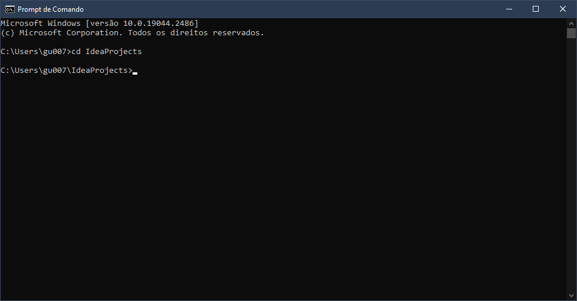
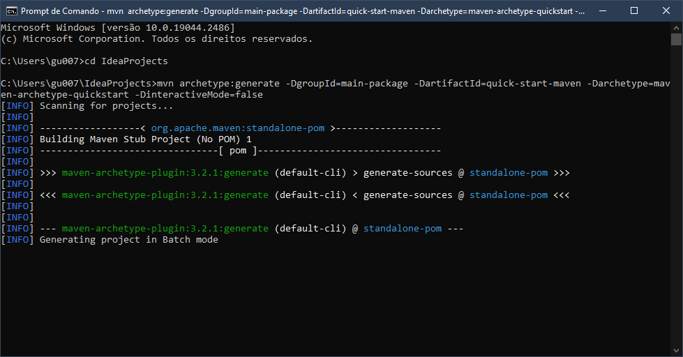

# Java

## Gerenciamento de Dependências e Build em Java com Maven

### Aula 01 - Criando um projeto via linha de comando

#### Passo 1

O primeiro passo é, por meio do CMD, acessar a pasta na qual você deseja criar um novo projeto em Maven.

No meu caso, estou acessando a mesma pasta do *IntelliJ*, que é a pasta *~IdeaProjects*, conforme [Imagem 1](img/img-1.png).



*Imagem 1 - Abrindo a pasta desejada*

---

#### Passo 2

O segundo passo é criar o projeto.

Para criar um projeto por meio do Maven, após acertar as configurações em seu computador, precisamos executar o seguinte comando (Consulte as [Imagem 2](./img/img-2.png) e [Imagem 3](./img/img-3.png))

```powershell
mvn archetype:generate -DgroupId=nomeDesejado -DartifactId=nomeDesejado -Darchetype=maven-archetype-quickstart -DinteractiveMode=false
```



*Imagem 2 - Projeto sendo criado em "Batch mode"*

---


*Imagem 3 - Projeto criado com sucesso*

##### OBS

- **-DgroudId:** Após o sinal de igualdade (=), você pode inserir o nome da pasta base na qual os arquivos de *main* e *test* serão armanenados. Pode-se dizer que se refere ao *package* do projeto.
- **-DartifactId:** Após o sinal de igualdade (=), você pode inserir o nome do projeto em si.
- **-Darchetype:** Após o sinal de igualdade (=), você pode inserir a "arquitetura" do projeto, inserindo um projeto base dos repositórios maven.
- **-DinteractiveMode:** Após o sinal de igualdade (=), você pode definí-lo como *false* ou *true*, ou seja, em modo *Batch* ou em modo *Interactive*. **Consulte a documentação**.